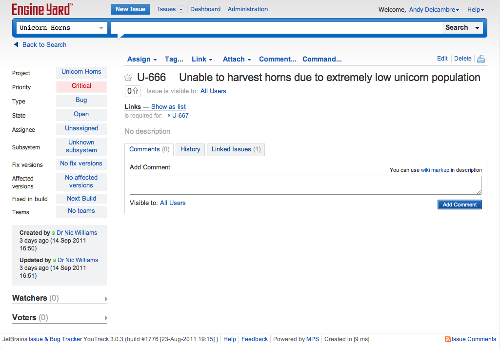

!SLIDE
# Pick up a ticket

!SLIDE !fullscreen

!SLIDE fullscreen

!SLIDE
# Consistent branch names

!SLIDE
    git checkout -b U-666

!SLIDE
# Commit Tagging

!SLIDE
    git commit -m "[U-666] More unicorns"

!SLIDE
# Pairing

